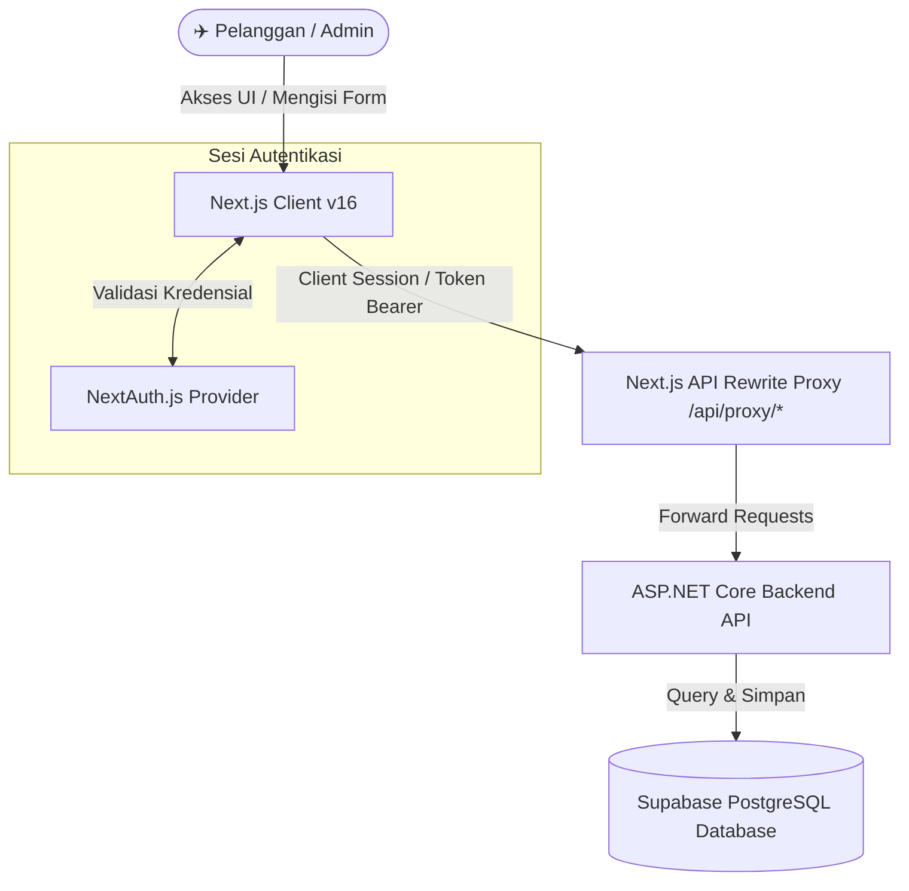

# ✈️ HORIZON AIR — Premium Flight Booking System

[](https://nextjs.org)
[](https://react.dev)
[](https://tailwindcss.com)
[](https://next-auth.js.org)
[](https://vercel.com)

**Horizon Air** adalah platform digital pemesanan tiket pesawat udara modern yang dirancang khusus dengan **Desain Premium Bertema Cahaya (Light Sky Theme)**. Proyek ini dikembangkan untuk **Project UKL (Ujian Kompetensi Keahlian) SMK Telkom Malang** guna menghadirkan pengalaman pemesanan tiket penerbangan kelas eksekutif dengan kemudahan aksesibilitas maksimal.

Aplikasi ini memiliki integrasi yang mulus antara **Portal Customer** untuk reservasi penerbangan instan dan **Panel Dashboard Admin** untuk mengelola data operasional penerbangan secara terpusat.

---

## 🎨 Keunggulan Desain & UX Modern

- 🌤️ **Premium Light Aesthetic:** Menggunakan latar belakang cerah bertekstur *soft radial blurs* bernuansa biru langit dan indigo untuk memberikan kesan clean, profesional, dan futuristik.
- 🔍 **Interactive Autocomplete Dropdown:** Menggantikan select dropdown standar dengan kolom input pencarian bandara interaktif yang mendeteksi kota, nama bandara, maupun kode IATA secara langsung dari database backend.
- ⚡ **Dynamic Flight Timeline:** Menampilkan informasi transit, durasi penerbangan, serta integrasi kelas bagasi (20kg), snack kabin, WiFi, dan garansi refund dengan diagram visual interaktif.
- 🔐 **Secure Form Validation:** Integrasi dengan React Hook Form dan Zod untuk memastikan keamanan data masukan pengguna serta keandalan saat registrasi dan pemesanan.
- 🕒 **Live Indonesian Clock Badge:** Dilengkapi dengan widget waktu rill dan tanggal lokal di halaman masuk & daftar guna memberikan kenyamanan presisi operasional bagi pengguna.

---

## 🚀 Tumpukan Teknologi (Tech Stack)

### Sisi Client (Frontend)
- **Framework Utama:** Next.js 16 (App Router) & React 19
- **Bahasa Pemrograman:** TypeScript
- **Styling & UI:** Tailwind CSS v4, Shadcn UI, & Lucide Icons
- **State Management:** TanStack React Query v5 & Axios Interceptors
- **Autentikasi:** NextAuth.js v4 (JWT Session Integration)

### Sisi Server (Backend)
- **API Server:** ASP.NET Core (Railway Production Engine)
- **Database Engine:** Supabase PostgreSQL

---

## 📊 Arsitektur Sistem

Berikut adalah alur komunikasi data antara Pengguna, Frontend Next.js, Gateway Proxy, dan API Server Backend:



---

## 🌟 Fitur Utama Aplikasi

| Komponen | Fitur Unggulan | Penjelasan Fungsional |
| :--- | :--- | :--- |
| **Landing Page** | 🌤️ **Search Widget Interaktif** | Memilih rute terbang (Asal & Tujuan) dengan auto-suggest pintar, tanggal, dan jumlah penumpang. |
| | ⭐ **Ulasan Pengguna (Testimonials)** | Slider umpan balik dari pebisnis dan pelancong premium untuk meningkatkan konversi. |
| | ❓ **FAQ Accordion** | Komponen interaktif tanya-jawab seputar reschedule, bagasi gratis, dan metode bayar. |
| **Portal Customer** | 📅 **Riwayat Tiket Saya** | Menyimpan riwayat pemesanan secara instan dan menampilkan boarding pass dalam format modal premium. |
| | 🎫 **Kupon Diskon Otomatis** | Menyalin dan mengaplikasikan voucher diskon (persentase/nominal rupiah) langsung pada invoice belanja. |
| | 🧑‍✈️ **Form Penumpang Fleksibel** | Validasi nomor identitas dan data diri dinamis berdasarkan jumlah manifes penumpang yang dipesan. |
| **Panel Admin** | 📊 **Operational Dashboard** | Widget rangkuman data bandara, penerbangan aktif, total armada, dan status server internal. |
| | 🛠️ **Master CRUD Database** | Manajemen penuh data Bandara (IATA), Maskapai, Jadwal Penerbangan, dan Voucher Promo. |
| | 🔁 **Live Status Manager** | Mengubah status delay, berangkat, atau pembatalan terbang secara real-time. |

---

## 🛠️ Panduan Instalasi & Pengembangan Lokal

### 1. Klon Proyek & Salin Konfigurasi Env
Buat sebuah berkas bernama `.env.local` di dalam direktori utama proyek Anda dan isi dengan nilai berikut:

```env
NEXT_PUBLIC_BACKEND_URL=your-backend-api-url
NEXTAUTH_URL=http://localhost:3000
NEXTAUTH_SECRET=your-nextauth-secret-key
```

### 2. Pasang Dependensi Node
Gunakan npm untuk mengunduh seluruh pustaka yang dibutuhkan proyek:
```bash
npm install
```

### 3. Jalankan Server Dev Lokal
Mulailah menjalankan server pengembangan lokal:
```bash
npm run dev
```
Setelah berjalan, buka browser kesayangan Anda dan kunjungi halaman: **[http://localhost:3000](http://localhost:3000)**.

### 4. Build untuk Produksi
Untuk melakukan kompilasi proyek dan optimasi production-ready bundle:
```bash
npm run build
```

---

## 🖥️ Sistem Autentikasi & Simulasi Akun

Proyek ini mendeteksi hak akses pengguna secara dinamis melalui username saat masuk (*Login*):
* **Hak Akses Admin:** Masuk menggunakan username yang mengandung kata **`admin`** (Contoh: `admin`, `admin123`, `administrator`). Sistem akan otomatis mengarahkan ke dasbor manajemen operasional `/admin`.
* **Hak Akses Customer:** Masuk menggunakan username lainnya secara bebas. Sistem akan otomatis mengarahkan ke halaman pencarian tiket `/customer`.

---

> 🔒 **Horizon Air** dilindungi oleh standar enkripsi JWT token berbasis NextAuth. Dibuat dengan presisi visual dan performa unggulan untuk LKS Provinsi Jawa Timur.
